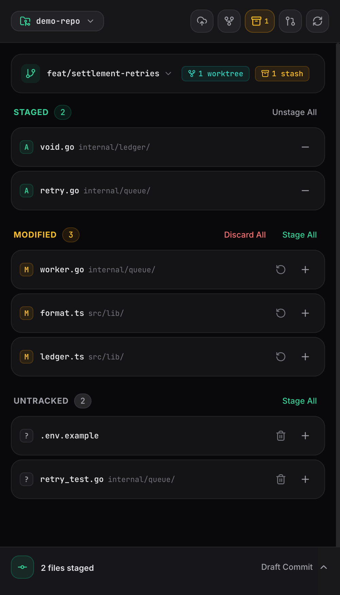
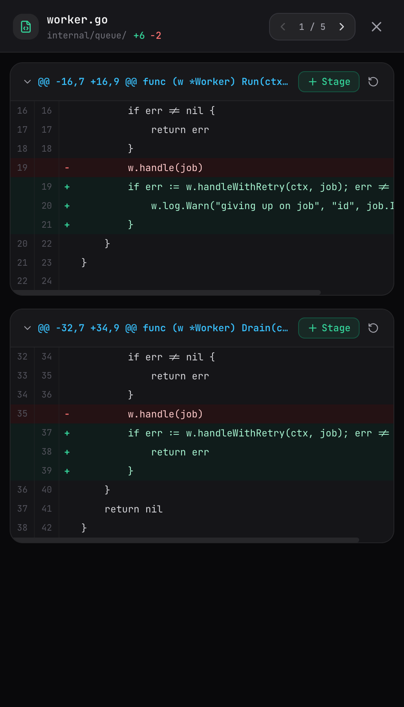
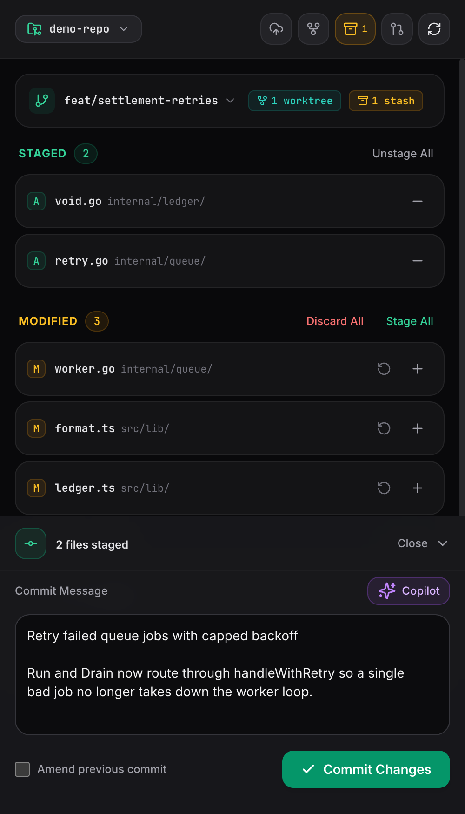
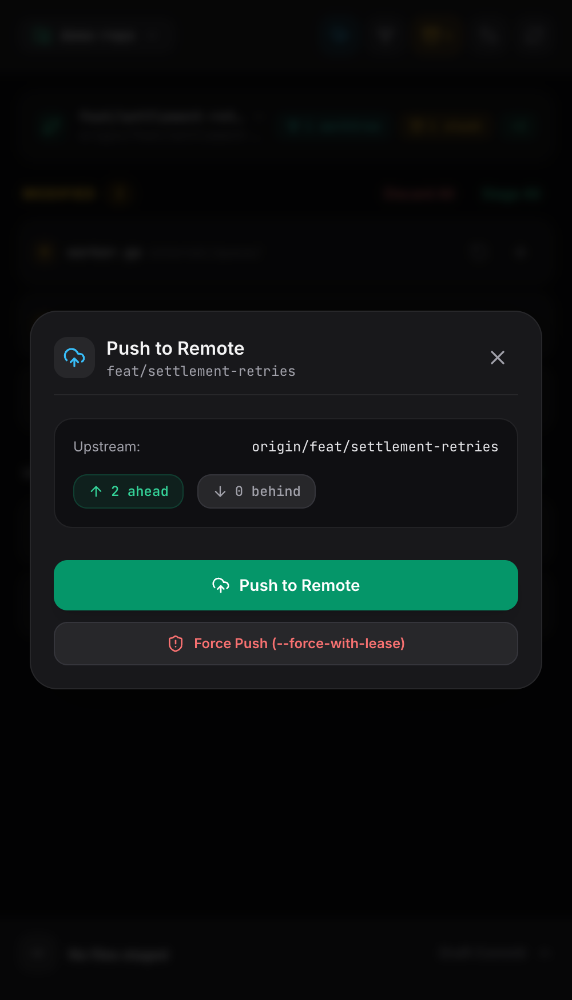

<p align="center">
  
</p>

<h1 align="center">Branch Office</h1>

<p align="center">
  <strong>A hyper-lightweight, mobile-friendly remote Git control center running locally on your host machine.</strong><br>
  <em>Your agents write it. You still commit it.</em>
</p>

<p align="center">
  <a href="https://branch-office.ishifishi.work">Website</a> •
  <a href="#screenshots">Screenshots</a> •
  <a href="#installation">Installation</a> •
  <a href="#features">Features</a> •
  <a href="#quick-start">Quick Start</a> •
  <a href="#remote-ssh--biometric-agent-setup">SSH & Biometrics</a>
</p>

---

Designed to be securely exposed over private networks like Tailscale, Branch Office lets you review diffs, stage files
or individual hunks, safely discard changes, draft commits, push (with optional `--force-with-lease` safeguards), and
manage GitHub pull requests directly from your phone.

This project was born from a personal need / desire. I was doing a lot of programming from my phone with agents, but as
a git purist, I don't allow my agents to commit on my behalf and use [Secretive](https://github.com/maxgoedjen/secretive)
(for managed SSH keys within Secure Enclave) which requires biometrics, but I still wanted to be able to review diffs,
stage hunks/files, review changes, write commit messages from my phone, and do all of the other lifecycle things like
pushing and opening PRs from my phone as well.

Doing that via SSH is a bit of a pain, and I also wanted an interface that saved on typing.

---

## Screenshots

| Status & Staging | Diff & Hunk Staging | Mobile Commit Drawer | Push to Remote |
| :---: | :---: | :---: | :---: |
|  |  |  |  |

---

## Features

- **Single Binary**: The entire mobile Vue 3 SPA is embedded into a compiled Go binary (`~9MB`). No external node runtime, python, or server dependencies needed in production.
- **Multi-Repository Workspace**: Seamlessly switch between multiple local Git projects from the mobile top bar. Register new directory paths or remove projects directly from the UI.
- **First-Class Git Worktrees**: Switch between linked worktrees, create new worktrees (with automatic branch checkout), and remove worktrees directly from mobile with dedicated live change detection.
- **Git Stash Interface**: Save uncommitted changes (with untracked files by default), inspect stash diffs, apply or pop stashes, and switch branches cleanly.
- **Git Tags & Release Management**: Create lightweight or annotated tags with version messages, and push tags directly to remote (`origin`) in one tap.
- **Full File & Hunk-Level Staging**: Stage whole files or inspect color-coded unified diffs and stage/unstage individual diff hunks with a tap.
- **Safe Discard Workflow**: Revert changes in modified files, untracked files, or specific diff hunks with deliberate confirmation safeguards.
- **Mobile-Optimized Commits**: Fixed bottom drawer with auto-sizing commit message input and amend toggles within thumb reach.
- **GitHub Copilot Commit Messages**: One-tap AI commit message generation from your staged diff via GitHub CLI (`gh copilot`) with author hint support.
- **Remote Synchronization & Safety**: Check ahead/behind commits and push upstream. Includes a guarded `--force-with-lease` button with explicit two-step confirmation dialogs.
- **GitHub Pull Requests**: Direct integration with the GitHub CLI (`gh`) to view existing PR status and open new PRs or draft PRs from your device.

---

## Installation

### Homebrew

```bash
brew install jejacks0n/tap/broffice
```

or

```bash
brew tap jejacks0n/tap
brew install broffice
```

### Build from Source

Requirements: Go 1.22+ and Node 18+ (for compiling the frontend).

```bash
# Build the embedded frontend and compile the Go binary
make build
```

The output executable is created at `bin/broffice`.

### Run Locally

```bash
# Automatically registers and opens the current Git repo
./bin/broffice

# Or specify a target repository path
./bin/broffice -dir /path/to/my-repo

# Or customize the listen port/address
./bin/broffice -addr 0.0.0.0:8080
```

### Access over Tailscale

To access Branch Office from your phone or tablet on your Tailscale tailnet:

```bash
# Option A: Expose via Tailscale Serve
tailscale serve --bg 8080

# Option B: Access directly via your machine's Tailscale IP or MagicDNS
# http://<machine-name>:8080 or http://100.x.y.z:8080
```

---

## SSH & Biometrics

f you use **SecretAgent**, **1Password SSH Agent**, or hardware security keys on your host machine, Git operations
normally require a physical fingerprint or password prompt. When accessing Branch Office remotely, you cannot provide
biometric authorization, which causes pushes or commits to block or fail.

Branch Office solves this with **process-level isolation**: your host machine continues using SecretAgent for regular
terminal and IDE work, while Branch Office uses a dedicated key for remote Git commands.

### Generate a Dedicated Remote Key

Create an unencrypted SSH key specifically for Branch Office:

```bash
ssh-keygen -t ed25519 -f ~/.ssh/broffice_ed25519 -C "branch-office-remote" -N ""
```

### Add Key to GitHub

```bash
gh ssh-key add ~/.ssh/broffice_ed25519.pub --title "Branch Office Host"
```

### Start Branch Office with Key & Signing Overrides

Launch Branch Office with the `-ssh-key` and `-no-sign` flags:

```bash
./bin/broffice -ssh-key ~/.ssh/broffice_ed25519 -no-sign
```

* **`-ssh-key <path>`**: Injects `GIT_SSH_COMMAND="ssh -i <path> -o IdentitiesOnly=yes"` and clears `SSH_AUTH_SOCK` for Git commands executed by Branch Office, completely bypassing SecretAgent.
* **`-no-sign`**: Passes `-c commit.gpgSign=false` to `git commit`, preventing SecretAgent or GPG from prompting for Touch ID when committing changes from your mobile device.

### Optional Environment Variables & Persistence

You can also set these options via environment variables:

```bash
export BROFFICE_SSH_KEY="~/.ssh/broffice_ed25519"
export BROFFICE_NO_SIGN="true"
./bin/broffice
```

Settings passed via flags or environment variables are automatically saved to `~/.config/broffice/config.json` for
subsequent launches.

---

## Development

Run the Go backend and Vite dev server concurrently:

```bash
# Terminal 1: Backend
go run ./cmd/broffice -addr 127.0.0.1:8080

# Terminal 2: Frontend with hot-reloading
cd web && npm run dev
```

Visit `http://localhost:5173` in your browser. Requests to `/api/*` are automatically proxied to the Go backend.

---

## Tests

Run the backend test suite:

```bash
make test
# or
go test -v ./...
```

---

## License

Branch Office is released under the MIT license:

* https://opensource.org/licenses/MIT

Copyright 2026 &copy; [jejacks0n](https://github.com/jejacks0n)

## Make Code Not War ♥
